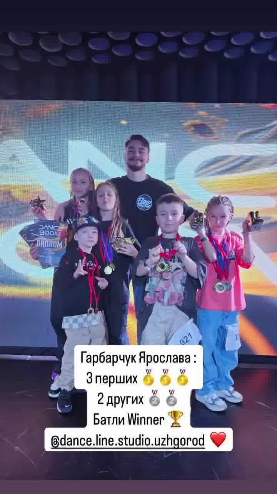
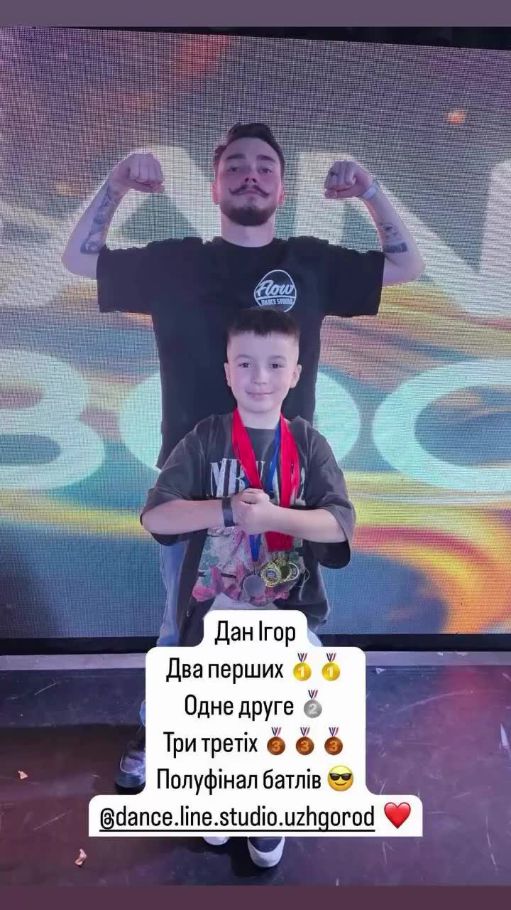

import imageAngelaFisher from './hip-hop-3.jpg'

export const article = {
  date: '2024-11-09',
  title: 'Наші юні хіп хоп танцівники не зупиняються на досягнутом',
  description:
    'Чергові змаганні і неймовірні досягнення, дякуючи нашому неперевершеному тренеру',
  author: {
    name: 'Angela Fisher',
    role: 'Front-end Developer',
    image: { src: imageAngelaFisher },
  },
}

export const metadata = {
  title: article.title,
  description: article.description,
}

## 1. Brevity is Key

Time is scarce, don’t waste it typing out long, descriptive component names. One approach is to give them short, cryptic names that only you will understand.

Need a button? Call it "btn". A modal? How about "md"? You’ll save precious minutes per day and you’ll get the added benefit of being the only person in the codebase who knows where anything is. This is called job security.

Наші юні хіп хоп танцівники не зупиняються на досягнутому😎🔥
Чергові змаганні і неймовірні досягнення, дякуючи нашому неперевершеному тренеру @nikone_g.s.f

Отже результати:
Мимренко Адель
6 перших місць 🥇🥇🥇🥇🥇🥇
1 друге місце 🥈
1 третє місце 🥉
Полуфінал Батлів 🔥

Дан Ігор
2 перших місця 🥇🥇
1 друге місце🥈
3 третіх місця🥉🥉🥉

Гарбарчук Ярослава
3 перших місця🥇🥇🥇
2 других місця🥈🥈
Батли Winner🏆

Ключніков Олександр
3 третіх місця🥉🥉🥉

Ключнікова Юлія
3 перших місця🥇🥇🥇
1 друге місце🥈
Півфінал Батлів🔥

Бондарева Аріна
3 третіх місця🥉🥉🥉
1 друге місце🥈
Батли 1/4🔥

Семенцова Аріна
1 друге місце🥈
1 четверте місце❣️
1 третє місце🥉
1 пʼяте місце❣️

Дякуємо нашому талановитому @nikone_g.s.f ❤️
А також @dance_boom_lviv за чудову організацію заходу🙏🫶

